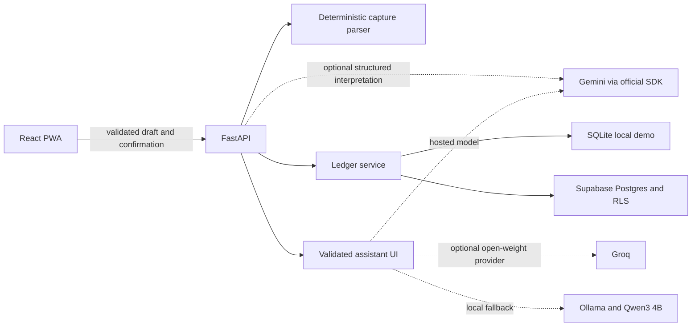

# Artha

[](https://github.com/snayan06/artha/actions/workflows/ci.yml)
[](LICENSE)
[](https://www.python.org/)
[](https://react.dev/)

Artha is an open-source, mobile-first money tracker for recording transactions
in natural language, understanding spending, and correctly accounting for
shared household expenses.

> [!IMPORTANT]
> Artha V1 is deployed on the intended personal Vercel and Supabase accounts.
> The hosted schema, API health check and PWA route fallback are green. Magic-link,
> two-identity isolation and recovery acceptance are still pending, so use
> fictional data until the complete deployment runbook is green.

## Why Artha?

Most expense trackers make capture slower than the purchase itself. Artha is
built around a five-second workflow:

1. Write `Paid 1840 for groceries from HDFC UPI, split with family, 3 days ago`.
2. Review the parsed amount, account, category and split.
3. Confirm explicitly.
4. See account movement, personal spending and the shared balance update.

Parsing never writes directly to the ledger. Common capture remains usable
without an AI provider through a deterministic parser. When enabled, Gemini may
propose a structured draft grounded only in the user's existing accounts,
categories and family participants; the user still reviews it before any write.

## V1 features

- Installable React and TypeScript PWA with responsive bottom navigation.
- Dashboard balances, six-month cash-flow chart and recent activity.
- Natural-language INR capture with a review-before-write workflow.
- Indian amount shorthand and account-to-account transfer capture such as
  `self transfer 25k ICICI -> HDFC`.
- First-run setup for multiple bank, cash, wallet and credit-card accounts.
- Configurable household members and exact per-member expense splits.
- Light, dark and system theme support.
- Privacy-filtered Vercel Web Analytics and Speed Insights; telemetry keeps the
  route but removes URL query strings and fragments before sending.
- Accounts, opening balances, income, expenses, transfers and settlements.
- Shared-expense accounting that separates cash movement from personal share.
- Transaction search plus type and per-account activity filters, including both
  sides of internal transfers.
- Recoverable magic-link states for expired, reused, wrong-browser and stale sessions.
- FastAPI, Pydantic and SQLAlchemy API with integer-paise money values.
- Replay-safe writes using idempotency keys.
- Supabase Postgres schema with constraints, RLS, audit events and atomic RPCs.
- Client-side encrypted export and preview-before-restore recovery; the
  passphrase never leaves the browser.
- Local SQLite demo that requires no cloud account or paid AI service.

## Architecture



| Layer | Technology |
|---|---|
| Web | React 19, TypeScript, Vite, Tailwind CSS, Recharts |
| API | Python 3.13, FastAPI, Pydantic v2, SQLAlchemy async |
| Local data | SQLite and aiosqlite |
| Production data | Supabase Postgres, Auth, RLS and REST/RPC adapter |
| Optional AI | Gemini via the official Google SDK, with Groq or local Ollama alternatives; validated output and deterministic fallback |
| Quality | Vitest, pytest, ESLint, Ruff and strict mypy |
| CI | GitHub Actions |

Money is stored as integer paise. Balances are derived from opening balances and
ledger movements. Transfers and settlements are not counted as spending or
income, and confirmed writes are idempotent.

## Repository layout

```text
artha/
├── apps/
│   ├── web/              # React PWA
│   └── api/              # FastAPI service and ledger rules
├── supabase/
│   ├── migrations/       # Schema, constraints, RLS and RPC functions
│   └── tests/            # SQL catalog assertions
├── docs/                 # PRD, architecture, deployment and decisions
├── evals/                # Versioned fictional model/parser evaluation data
├── scripts/              # Repository contract and evaluation helpers
├── .github/workflows/    # CI
└── render.yaml           # Optional container-hosting fallback
```

## Run locally

Requirements:

- Node.js 22 or newer
- Python 3.13
- [`uv`](https://docs.astral.sh/uv/)
- GNU Make (optional; the underlying commands also work directly)

```bash
git clone https://github.com/snayan06/artha.git
cd artha
cp .env.example .env
make setup
```

Start the API:

```bash
make dev-api
```

Start the web application in a second terminal:

```bash
make dev-web
```

Open <http://127.0.0.1:5173>. Interactive API documentation is available at
<http://127.0.0.1:8000/docs>.

### Optional Gemini assistant

Capture and manual analytics work without an LLM. The private pilot uses
`gemini-3.5-flash-lite` behind the provider adapter; it is not trusted to write
or calculate ledger values. Keep the API key only in the server environment:

```dotenv
ARTHA_LLM_PROVIDER=gemini
ARTHA_GEMINI_API_KEY=your-server-side-key
ARTHA_GEMINI_MODEL=gemini-3.5-flash-lite
```

Gemini requests are stateless (`store=false`) and model output is validated by
Artha before use. Google's free tier may use submitted content to improve its
products, so use fictional data on the free tier; real family finance should use
an appropriate paid privacy configuration. For a private local fallback, install
Ollama, pull `qwen3:4b-instruct`, and set `ARTHA_LLM_PROVIDER=ollama`. Provider
failure falls back to deterministic cards and manual tagging; it never blocks
ledger capture.

## Quality gate

Run the same checks used by CI:

```bash
make check
```

This runs web linting, TypeScript checks, Vitest, the production PWA build,
Ruff, strict mypy, pytest, every SQL syntax contract, and both keyless validators
for the 50-case capture dataset and hosted-model runner.

## API surface

| Method | Endpoint | Purpose |
|---|---|---|
| `GET` | `/health` | Service health and API version |
| `POST` | `/api/v1/demo/bootstrap` | Create fictional local demo data |
| `GET/POST` | `/api/v1/accounts` | List or create accounts |
| `POST` | `/api/v1/onboarding/setup` | Atomically create accounts and household members |
| `GET` | `/api/v1/profile` | Load the authenticated user's server-owned profile and household |
| `GET/POST` | `/api/v1/members` | List or create household participants |
| `GET/POST` | `/api/v1/merchant-rules` | Manage deterministic household auto-tag rules |
| `POST` | `/api/v1/merchant-rules/learn` | Explicitly remember a prospective merchant rule |
| `POST` | `/api/v1/drafts/parse` | Parse an unsaved transaction draft |
| `POST` | `/api/v1/transactions/confirm` | Confirm a reviewed draft idempotently |
| `GET` | `/api/v1/transactions` | List confirmed transactions |
| `PATCH/DELETE` | `/api/v1/transactions/{id}` | Correct or soft-delete a transaction |
| `GET` | `/api/v1/dashboard` | Derived balances and chart data |
| `GET` | `/api/v1/shared-balances` | Per-member receivables and payables |
| `GET` | `/api/v1/assistant/status` | Report configured assistant provider without exposing secrets |
| `POST` | `/api/v1/assistant/chat` | Return validated read-only cards, charts or tables |
| `POST` | `/api/v1/assistant/tag-suggestion` | Suggest an allow-listed category without saving it |

## Deployment status

The private-pilot topology is live: two Vercel Hobby projects (`apps/web` and
`apps/api`) plus the fresh personal `artha-production` Supabase Free project.
The previous Cloudflare Pages + Render path remains an optional container
fallback.

- PWA: <https://artha-web-one.vercel.app>
- API health: <https://artha-api-mu.vercel.app/health>

Before production can be called green:

- verify magic-link login, refresh and sign-out on the final domain;
- repeat two-identity household isolation on the personal production database;
- verify final-domain authentication, export and restore behavior.

See [the deployment runbook](docs/DEPLOYMENT.md) for the complete acceptance gate.
The current ordered status and named blockers are in the
[sprint board](docs/SPRINT-BOARD.md).

## Roadmap

- Final-domain encrypted recovery and two-household isolation drills.
- Member invitations and collaborative household access.
- Optional WhatsApp or Telegram draft capture.
- Read-only analytics agent with validated inline metric, chart and table UI.
- Investments, liabilities and net-worth tracking.

The implementation checklist is maintained in [docs/TASKS.md](docs/TASKS.md).
The current, user-readable delivery status is maintained in
[docs/SPRINT-BOARD.md](docs/SPRINT-BOARD.md).

## Contributing and security

Contributions are welcome. Read [CONTRIBUTING.md](CONTRIBUTING.md) before opening
a pull request. Never include real financial data in issues, fixtures or
screenshots. Report vulnerabilities according to [SECURITY.md](SECURITY.md).

## Documentation

- [Current project checkpoint](docs/PROJECT-CHECKPOINT.md)
- [Product requirements](docs/product-requirements.md)
- [Private-pilot product audit and priority reset](docs/product-audit-2026-08-04.md)
- [System architecture](docs/system-architecture.md)
- [Database structure](docs/database-schema.md)
- [Auto-tagging design](docs/auto-tagging.md)
- [Architecture decisions](docs/DECISIONS.md)
- [Deployment runbook](docs/DEPLOYMENT.md)
- [Implementation checklist](docs/TASKS.md)
- [Current sprint board](docs/SPRINT-BOARD.md)
- [Documentation artifacts and release evidence](docs/artifacts/)
- [Capture-parser evaluation dataset](evals/README.md)

## License

Released under the [MIT License](LICENSE).
