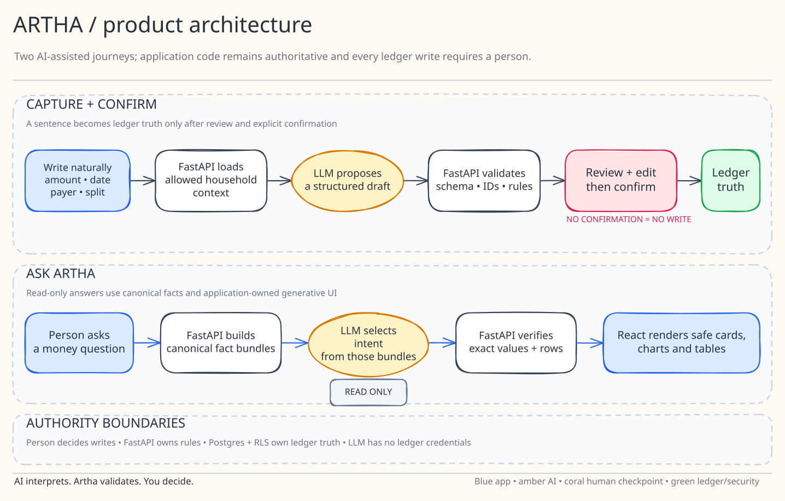

# Artha

[](https://artha-web-one.vercel.app)
[](LICENSE)
[](https://www.python.org/)
[](https://react.dev/)

Artha is a mobile-first private money companion for people who want clarity
without turning every expense into bookkeeping. Write what happened in everyday
language, review the draft, and let Artha keep accounts, cards, transfers and
shared family expenses consistent.

> [!IMPORTANT]
> **Private-pilot status:** V1 is deployed and has passed real final-domain
> sign-in, onboarding, capture, transfer, shared-expense, assistant, encrypted
> export and responsive tests using fictional data. Keep using fictional data
> until the two-owner isolation and final-domain restore drills are also signed
> off.

## Product at a glance

| | |
| --- | --- |
| **For** | An individual managing money across several bank accounts and cards, with friends or family involved in some expenses |
| **Problem** | Logging is tedious, transfers get mistaken for spending, and shared bills distort personal totals |
| **Promise** | Capture a transaction in seconds, see exactly what Artha understood, and save only after explicit confirmation |
| **Current scope** | A private personal ledger with non-login participants for expense splits |
| **Next scope** | Post-onboarding account management, audited corrections and invited family access |
| **Live pilot** | [Web app](https://artha-web-one.vercel.app) · [API health](https://artha-api-mu.vercel.app/health) |

## Why Artha?

Money tracking often fails at the exact moment it asks you to stop and do
bookkeeping. Artha starts with the sentence already in your head:

> `Paid ₹1,840 for groceries from HDFC, split with Krima, three days ago.`

Or simply:

> `self transfer 25k ICICI -> HDFC`

Artha turns that into an **unsaved draft** containing the amount, transaction
type, accounts, date, category and sharing details. Review it, correct anything,
then confirm. Only confirmation changes the ledger.

That gives you one private view across bank accounts, cards, internal transfers,
personal spending and expenses shared with family or friends—without making
capture itself feel like accounting.

> **AI interprets. Artha validates. You decide what gets saved.**

## Core journeys

1. **Set up once.** Add multiple bank, cash, wallet and credit-card accounts,
   opening balances, card details and people you split expenses with.
2. **Write naturally.** Try `self transfer 25k ICICI -> HDFC` or
   `Paid 1840 for groceries from HDFC, split with Krima, 3 days ago`.
3. **Review before saving.** Check the amount, date, type, account, category and
   split. Nothing reaches the ledger until confirmation.
4. **Understand the result.** See balances, personal spending, income, account
   activity, shared receivables and a six-month trend.
5. **Ask the ledger.** Gemini selects an approved answer pattern and safe
   widgets around values calculated by Artha—never model-authored HTML, model-
   calculated balances or direct writes.
6. **Keep control.** Export a client-side encrypted backup whose passphrase never
   reaches the API.

If Gemini cannot interpret Quick Add, Artha keeps the exact text and opens the
manual form. It does not guess. Dashboard and manual entry remain available;
the assistant shows an honest error when its model is unavailable.

## What V1 includes

### Fast capture and correct accounting

- Natural-language INR capture with a review-before-write workflow.
- Indian amount shorthand and account-to-account transfer capture such as
  `self transfer 25k ICICI -> HDFC`.
- Accounts, opening balances, income, expenses, transfers and settlements.
- Shared-expense accounting that separates cash movement from personal share.
- Transaction search plus type and per-account activity filters, including both
  sides of internal transfers.

### Everyday product experience

- Installable React and TypeScript PWA with responsive bottom navigation.
- Dashboard balances, six-month cash-flow chart and recent activity.
- First-run setup for multiple bank, cash, wallet and credit-card accounts.
- Configurable household participants and exact per-person expense splits.
- Read-only Gemini assistant with safe inline metrics, charts and tables.
- Light, dark and system theme support across mobile and desktop.

### Privacy, reliability and portability

- Recoverable magic-link states for expired, reused, wrong-browser and stale sessions.
- Replay-safe writes using idempotency keys.
- Supabase Postgres schema with constraints, RLS, audit events and atomic RPCs.
- Client-side encrypted export and preview-before-restore recovery; the
  passphrase never leaves the browser.
- Privacy-filtered Vercel Web Analytics and Speed Insights; telemetry keeps the
  route but removes URL query strings and fragments before sending.
- Local SQLite demo that requires no cloud account or paid AI service.

The backend uses FastAPI, Pydantic and SQLAlchemy, and stores money as integer
paise rather than floating-point values.

## Architecture



Gemini interprets authenticated household context, but strict application code
owns every trust boundary: schemas, allowed IDs, integer-paise and split maths,
authentication, RLS, idempotency and ledger invariants. A draft is not a
transaction; only the reviewed confirmation can write.

The assistant follows the same separation. Database code calculates financial
values, Gemini chooses an approved qualitative narrative and allow-listed
widgets, and React renders them. Model failure produces no guessed draft or
assistant answer.

| Layer | Technology |
|---|---|
| Web | React 19, TypeScript, Vite, Tailwind CSS, Recharts |
| API | Python 3.13, FastAPI, Pydantic v2, SQLAlchemy async |
| Local data | SQLite and aiosqlite |
| Production data | Supabase Postgres, Auth, RLS and REST/RPC adapter |
| Production AI | Gemini via the official Google SDK; strict schemas and allow-lists; manual recovery when interpretation is unavailable |
| Quality | Vitest, pytest, ESLint, Ruff and strict mypy |
| CI | GitHub Actions |

Money is stored as integer paise. Balances are derived from opening balances and
ledger movements. Transfers and settlements are not counted as spending or
income, and confirmed writes are idempotent.

## Repository layout

```text
artha/
├── apps/
│   ├── web/              # React PWA
│   └── api/              # FastAPI service and ledger rules
├── supabase/
│   ├── migrations/       # Schema, constraints, RLS and RPC functions
│   └── tests/            # SQL catalog assertions
├── docs/                 # PRD, architecture, deployment, decisions and assets
├── evals/                # Versioned fictional model/parser evaluation data
├── scripts/              # Repository contract and evaluation helpers
├── .github/workflows/    # CI
└── render.yaml           # Optional container-hosting fallback
```

## Run locally

Requirements:

- Node.js 22 or newer
- Python 3.13
- [`uv`](https://docs.astral.sh/uv/)
- GNU Make (optional; the underlying commands also work directly)

```bash
git clone https://github.com/snayan06/artha.git
cd artha
cp .env.example .env
make setup
```

Start the API:

```bash
make dev-api
```

Start the web application in a second terminal:

```bash
make dev-web
```

Open <http://127.0.0.1:5173>. Interactive API documentation is available at
<http://127.0.0.1:8000/docs>.

### Gemini in the private pilot

Production natural-language capture and the assistant require configured
Gemini. The current pilot model is `gemini-3.5-flash-lite`, called only from the
server through the official SDK. It is not trusted to write or calculate ledger
values. Keep the API key only in the server environment:

```dotenv
ARTHA_LLM_PROVIDER=gemini
ARTHA_GEMINI_API_KEY=your-server-side-key
ARTHA_GEMINI_MODEL=gemini-3.5-flash-lite
```

Gemini requests are stateless (`store=false`) and model output is validated by
Artha before use. If capture interpretation fails, the exact input is preserved
and the manual transaction form opens; no guessed draft is created. If the
assistant model fails, Artha returns a sanitized unavailable response rather
than fabricating an answer. Manual entry and database-backed dashboards remain
available without an LLM.

Google's free tier may use submitted content to improve its products, so use
fictional data on the free tier; real family finance should use an appropriate
paid privacy configuration. Developers may explicitly select Ollama for local
experimentation, but it is not part of the production pilot path.

## Quality gate

Run the same checks used by CI:

```bash
make check
```

This runs web linting, TypeScript checks, Vitest, the production PWA build,
Ruff, strict mypy, pytest, every SQL syntax contract, and both keyless validators
for the 50-case capture dataset and hosted-model runner.

Previous release evidence (recorded before the current documentation pass):

| Gate | Result |
| --- | --- |
| Web | 16 test files, 103 tests passed |
| API | 122 tests passed |
| AI contracts | 50 capture, 30 auto-tag and 24 assistant cases valid |
| Hosted Gemini on fictional data | 50/50 capture, 30/30 auto-tag, 24/24 assistant |
| Production UI | All six primary pages fit at 320 px, 390 px and 1440 px; light/dark controls and mobile/desktop dark UI verified |
| Production flows | Magic-link new/returning login, session persistence, onboarding, expense, income, transfer, split, filters, assistant and encrypted export passed |

## API surface

| Method | Endpoint | Purpose |
|---|---|---|
| `GET` | `/health` | Service health and API version |
| `POST` | `/api/v1/demo/bootstrap` | Create fictional local demo data |
| `GET/POST` | `/api/v1/accounts` | List or create accounts |
| `POST` | `/api/v1/onboarding/setup` | Atomically create accounts and household members |
| `GET` | `/api/v1/profile` | Load the authenticated user's server-owned profile and household |
| `GET/POST` | `/api/v1/members` | List or create household participants |
| `GET/POST` | `/api/v1/merchant-rules` | Manage deterministic household auto-tag rules |
| `POST` | `/api/v1/merchant-rules/learn` | Explicitly remember a prospective merchant rule |
| `POST` | `/api/v1/drafts/parse` | Parse an unsaved transaction draft |
| `POST` | `/api/v1/transactions/confirm` | Confirm a reviewed draft idempotently |
| `GET` | `/api/v1/transactions` | List confirmed transactions |
| `PATCH/DELETE` | `/api/v1/transactions/{id}` | Correct or soft-delete a transaction |
| `GET` | `/api/v1/dashboard` | Derived balances and chart data |
| `GET` | `/api/v1/shared-balances` | Per-member receivables and payables |
| `GET` | `/api/v1/assistant/status` | Report configured assistant provider without exposing secrets |
| `POST` | `/api/v1/assistant/chat` | Return validated read-only cards, charts or tables |
| `POST` | `/api/v1/assistant/tag-suggestion` | Suggest an allow-listed category without saving it |
| `GET` | `/api/v1/recovery/export` | Export the authenticated household bundle for client-side encryption |
| `POST` | `/api/v1/recovery/preview` | Validate and summarize a decrypted bundle without writing it |
| `POST` | `/api/v1/recovery/restore` | Atomically restore a validated bundle into a fresh/empty household |

## Deployment status

The private-pilot topology is live: two Vercel Hobby projects (`apps/web` and
`apps/api`) plus the personal `artha-production` Supabase Free project. The
previous Cloudflare Pages + Render path remains an optional container fallback.

- PWA: <https://artha-web-one.vercel.app>
- API health: <https://artha-api-mu.vercel.app/health>

The deployed fictional-data acceptance pass now covers new and returning
magic-link users, persisted sessions, multi-account onboarding, financial
flows, Gemini capture/assistant behavior, encrypted export, responsive layouts
and security headers.

Before entering real financial data:

- prove two independent owners cannot read or write each other's households;
- restore the encrypted fictional backup into a fresh/empty production household;
- record sanitized authenticated cold/warm latency and log-redaction evidence.

See [the deployment runbook](docs/DEPLOYMENT.md) for the complete acceptance gate.
The current ordered status and named blockers are in the
[sprint board](docs/SPRINT-BOARD.md).

## Roadmap

- Complete final-domain encrypted restore and two-household isolation drills.
- Post-onboarding account/card/participant management and audited corrections.
- Member invitations and collaborative household access.
- Optional WhatsApp or Telegram draft capture.
- Investments, liabilities and net-worth tracking.

The implementation checklist is maintained in [docs/TASKS.md](docs/TASKS.md).
The current, user-readable delivery status is maintained in
[docs/SPRINT-BOARD.md](docs/SPRINT-BOARD.md).

## Contributing and security

Contributions are welcome. Read [CONTRIBUTING.md](CONTRIBUTING.md) before opening
a pull request. Never include real financial data in issues, fixtures or
screenshots. Report vulnerabilities according to [SECURITY.md](SECURITY.md).

## Documentation

- [Current project checkpoint](docs/PROJECT-CHECKPOINT.md)
- [Product requirements](docs/product-requirements.md)
- [Private-pilot product audit and priority reset](docs/product-audit-2026-08-04.md)
- [System architecture](docs/system-architecture.md)
- [Database structure](docs/database-schema.md)
- [Auto-tagging design](docs/auto-tagging.md)
- [Architecture decisions](docs/DECISIONS.md)
- [Deployment runbook](docs/DEPLOYMENT.md)
- [Implementation checklist](docs/TASKS.md)
- [Current sprint board](docs/SPRINT-BOARD.md)
- [Documentation artifacts and release evidence](docs/artifacts/)
- [Capture-parser evaluation dataset](evals/README.md)

## License

Released under the [MIT License](LICENSE).
