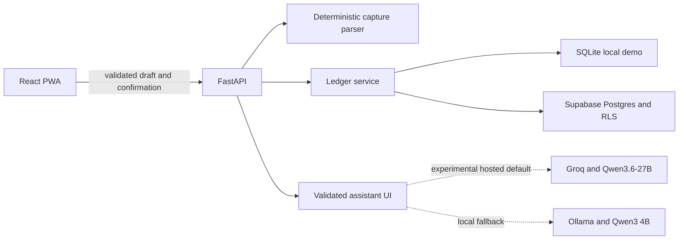

# Artha

[](https://github.com/snayan06/artha/actions/workflows/ci.yml)
[](LICENSE)
[](https://www.python.org/)
[](https://react.dev/)

Artha is an open-source, mobile-first money tracker for recording transactions
in natural language, understanding spending, and correctly accounting for
shared household expenses.

> [!IMPORTANT]
> Artha V1 has a verified local build and a tested legacy Supabase staging path.
> Production JWT verification, the REST/RPC repository and two-household RLS
> isolation pass, but that staging project is under the wrong account and will
> not be used for launch. Personal hosting, magic-link and recovery acceptance
> are still pending, so use fictional data until the deployment runbook is green.

## Why Artha?

Most expense trackers make capture slower than the purchase itself. Artha is
built around a five-second workflow:

1. Write `Paid 1840 for groceries from HDFC UPI, split with family, 3 days ago`.
2. Review the parsed amount, account, category and split.
3. Confirm explicitly.
4. See account movement, personal spending and the shared balance update.

Parsing never writes directly to the ledger. The application remains usable
without an AI provider because common capture is deterministic and rules-first.

## V1 features

- Installable React and TypeScript PWA with responsive bottom navigation.
- Dashboard balances, six-month cash-flow chart and recent activity.
- Natural-language INR capture with a review-before-write workflow.
- First-run setup for multiple bank, cash, wallet and credit-card accounts.
- Configurable household members and exact per-member expense splits.
- Light, dark and system theme support.
- Accounts, opening balances, income, expenses, transfers and settlements.
- Shared-expense accounting that separates cash movement from personal share.
- Transaction search and debit, credit and shared filters.
- FastAPI, Pydantic and SQLAlchemy API with integer-paise money values.
- Replay-safe writes using idempotency keys.
- Supabase Postgres schema with constraints, RLS, audit events and atomic RPCs.
- Local SQLite demo that requires no cloud account or paid AI service.

## Architecture



| Layer | Technology |
|---|---|
| Web | React 19, TypeScript, Vite, Tailwind CSS, Recharts |
| API | Python 3.13, FastAPI, Pydantic v2, SQLAlchemy async |
| Local data | SQLite and aiosqlite |
| Production data | Supabase Postgres, Auth, RLS and REST/RPC adapter |
| Optional AI | Open-weight Qwen via Groq or local Ollama; deterministic fallback |
| Quality | Vitest, pytest, ESLint, Ruff and strict mypy |
| CI | GitHub Actions |

Money is stored as integer paise. Balances are derived from opening balances and
ledger movements. Transfers and settlements are not counted as spending or
income, and confirmed writes are idempotent.

## Repository layout

```text
artha/
├── apps/
│   ├── web/              # React PWA
│   └── api/              # FastAPI service and ledger rules
├── supabase/
│   ├── migrations/       # Schema, constraints, RLS and RPC functions
│   └── tests/            # SQL catalog assertions
├── docs/                 # PRD, architecture, deployment and decisions
├── .github/workflows/    # CI
└── render.yaml           # Production-mode private-pilot blueprint
```

## Run locally

Requirements:

- Node.js 22 or newer
- Python 3.13
- [`uv`](https://docs.astral.sh/uv/)
- GNU Make (optional; the underlying commands also work directly)

```bash
git clone https://github.com/snayan06/artha.git
cd artha
cp .env.example .env
make setup
```

Start the API:

```bash
make dev-api
```

Start the web application in a second terminal:

```bash
make dev-web
```

Open <http://localhost:5173>. Interactive API documentation is available at
<http://localhost:8000/docs>.

### Optional experimental open-weight assistant

Capture and manual analytics work without an LLM. The private pilot uses
Qwen3.6-27B as an experimental hosted default; it remains behind the provider
adapter and is not trusted to write or calculate ledger values. To enable it,
create a Groq API key and keep it only in the API environment:

```dotenv
ARTHA_LLM_PROVIDER=groq
ARTHA_GROQ_API_KEY=your-server-side-key
ARTHA_GROQ_MODEL=qwen/qwen3.6-27b
```

For a private local fallback, install Ollama, pull `qwen3:4b-instruct`, and set
`ARTHA_LLM_PROVIDER=ollama`. Provider failure falls back to deterministic cards
and manual tagging; it never blocks ledger capture.

## Quality gate

Run the same checks used by CI:

```bash
make check
```

This runs web linting, TypeScript checks, Vitest, the production PWA build,
Ruff, strict mypy and pytest.

## API surface

| Method | Endpoint | Purpose |
|---|---|---|
| `GET` | `/health` | Service health and API version |
| `POST` | `/api/v1/demo/bootstrap` | Create fictional local demo data |
| `GET/POST` | `/api/v1/accounts` | List or create accounts |
| `POST` | `/api/v1/onboarding/setup` | Atomically create accounts and household members |
| `GET/POST` | `/api/v1/members` | List or create household participants |
| `GET/POST` | `/api/v1/merchant-rules` | Manage deterministic household auto-tag rules |
| `POST` | `/api/v1/merchant-rules/learn` | Explicitly remember a prospective merchant rule |
| `POST` | `/api/v1/drafts/parse` | Parse an unsaved transaction draft |
| `POST` | `/api/v1/transactions/confirm` | Confirm a reviewed draft idempotently |
| `GET` | `/api/v1/transactions` | List confirmed transactions |
| `PATCH/DELETE` | `/api/v1/transactions/{id}` | Correct or soft-delete a transaction |
| `GET` | `/api/v1/dashboard` | Derived balances and chart data |
| `GET` | `/api/v1/shared-balances` | Per-member receivables and payables |
| `GET` | `/api/v1/assistant/status` | Report configured assistant provider without exposing secrets |
| `POST` | `/api/v1/assistant/chat` | Return validated read-only cards, charts or tables |
| `POST` | `/api/v1/assistant/tag-suggestion` | Suggest an allow-listed category without saving it |

## Deployment status

The application and database contracts are ready, but the final personal-account
hosting topology is intentionally not locked yet. The previous Cloudflare Pages,
Render Free and Supabase Free topology remains a tested baseline; Vercel for the
PWA and FastAPI plus Supabase is the leading simpler option under review. The
legacy Supabase staging schema and RLS isolation exercise are green, but that
project is not approved for real Artha data.

Before production can be called green:

- create personal hosting and Supabase accounts with no legacy account ownership;
- deploy and verify the final API and PWA URLs;
- verify magic-link login, refresh and sign-out on the final domain;
- verify final-domain authentication, export and restore behavior.

See [the deployment runbook](docs/DEPLOYMENT.md) for the complete acceptance gate.

## Roadmap

- Encrypted export/restore and final-domain recovery drills.
- Member invitations and collaborative household access.
- Optional WhatsApp or Telegram draft capture.
- Read-only analytics agent with validated inline metric, chart and table UI.
- Investments, liabilities and net-worth tracking.

The implementation checklist is maintained in [docs/TASKS.md](docs/TASKS.md).

## Contributing and security

Contributions are welcome. Read [CONTRIBUTING.md](CONTRIBUTING.md) before opening
a pull request. Never include real financial data in issues, fixtures or
screenshots. Report vulnerabilities according to [SECURITY.md](SECURITY.md).

## Documentation

- [Product requirements](docs/product-requirements.md)
- [System architecture](docs/system-architecture.md)
- [Database structure](docs/database-schema.md)
- [Auto-tagging design](docs/auto-tagging.md)
- [Architecture decisions](docs/DECISIONS.md)
- [Deployment runbook](docs/DEPLOYMENT.md)
- [Implementation checklist](docs/TASKS.md)
- [Documentation artifacts and release evidence](docs/artifacts/)

## License

Released under the [MIT License](LICENSE).
