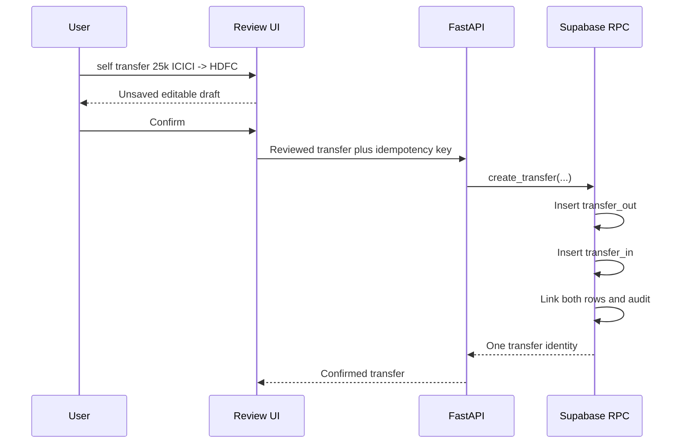

# Atomic account-transfer contract

Date: 4 August 2026  
Status: backend contract implemented and automated tests passing

## Product invariant

Moving money between two accounts owned by the same household is neither income
nor spending. It changes two account balances by equal and opposite amounts and
therefore leaves the household total unchanged.

## Write path

All database inserts occur in one PostgreSQL transaction. If any constraint
fails, no half-transfer survives. Repeating the same request with the same
idempotency key returns the existing result; reusing that key for different
content is rejected.

## Defensive rules

- Amount must be a positive integer number of paise.
- Source and destination must differ.
- Both accounts must be active accounts in the authenticated household.
- Currency must match.
- Transfers cannot contain expense splits.
- The browser never receives a database service-role secret.

## Implementation and tests

- API validation and confirmation: `apps/api/src/artha_api/production_routes.py`
- Atomic database function: `supabase/migrations/20260804020000_ledger_p1_hardening.sql`
- Production API tests: `apps/api/tests/test_production_routes.py`
- SQL contract assertions: `supabase/tests/001_schema_assertions.sql`

The local gate passed 87 API tests, including atomic RPC delegation,
same-account rejection and collapsing the two storage rows into one history
movement with zero net cashflow.
