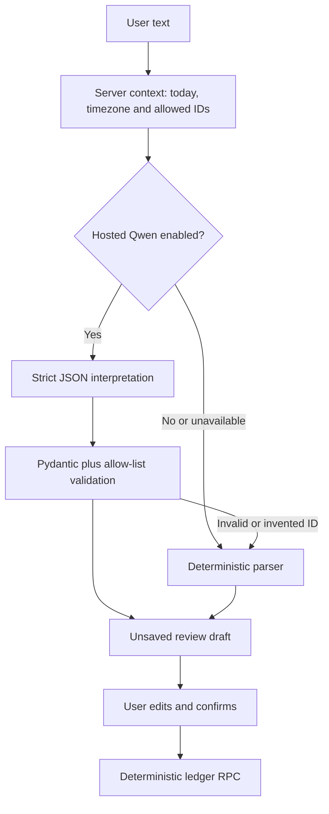

# LLM usage map and safety boundary

Date: 4 August 2026  
Status: structured Qwen adapter implemented; hosted provider disabled pending key and benchmark

## Where an LLM is used

| Feature | Model job | Deterministic boundary | May write data? |
| --- | --- | --- | --- |
| Quick Add | Interpret natural text into a proposed structured draft | Pydantic schema, account/member/category allow-lists, integer paise and date validation | No |
| Auto-tagging | Suggest an existing category only when merchant rules cannot decide | Learned rule first; model may select only an existing category ID | No |
| Assistant | Choose a read-only analysis intent and validated metric/chart/table widgets | Server calculates ledger totals; widget schemas limit output | No |

## Quick Add decision flow

The model is allowed to reason about phrases such as `25k`, `three days ago`,
account aliases and transfer direction. It is not allowed to invent an account,
member or category, calculate the authoritative balance, or bypass confirmation.
Ambiguous input returns a clarification question and unsafe input returns a
rejection; neither is coerced into a positive draft.

## Current runtime truth

- The open-weight family selected for the private pilot is Qwen.
- Hosted inference is wired through Groq; local private inference is wired
  through Ollama.
- No hosted model runs until `ARTHA_GROQ_API_KEY` is configured directly on the
  API deployment.
- Until then, common capture uses the deterministic parser and ambiguous input
  remains in review or clarification.
- Enabling a key is not the production lock-in decision. The versioned benchmark
  must pass first.

## Implementation and evaluation

- Structured schema and provider adapter: `apps/api/src/artha_api/assistant.py`
- Production parse endpoint: `apps/api/src/artha_api/production_routes.py`
- Schema/provider tests: `apps/api/tests/test_assistant.py`
- Dataset: `evals/capture-parser-v1.jsonl`
- Dataset contract checker: `scripts/check_capture_evals.py`
