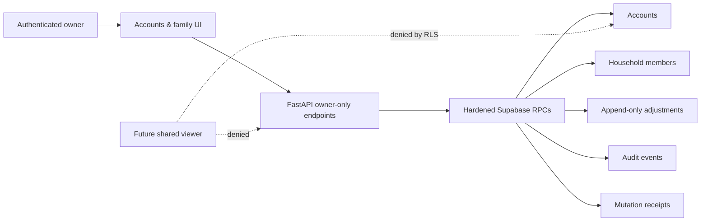

# Accounts & family management architecture

Date: 6 August 2026  
Status: implementation design; no production code implemented by this artifact  
Scope: owner-managed accounts, cards, household profile and non-login participants

## Outcome

Add an **Accounts & family** settings area where a household owner can:

- add, rename, archive and restore banks, cash accounts, wallets and cards;
- update credit limits, statement days and payment due days;
- record an auditable balance correction without rewriting ledger history;
- rename the household and their own display name;
- add, rename, deactivate and restore non-login household participants.

Authenticated invitations and `shared_viewer` access remain a separate feature.
This design provides the security seam it needs, but does not quietly turn a
participant record into a login identity.

## Non-negotiable invariants

1. Money remains integer paise from browser to database.
2. Existing transactions, splits and opening balances are not rewritten by a
   settings edit.
3. Account type and currency become immutable after creation.
4. Archive/deactivate is reversible; hard delete is not exposed.
5. Historical rows keep resolving their linked account and participant labels
   after rename/archive; financial facts are never rewritten.
6. Only an active household owner can use management reads or writes.
7. Every write is validated, idempotent and appended to `audit_events`.
8. The browser uses the authenticated API only; it never receives a service-role
   credential.
9. An account with a non-zero derived balance cannot be archived.
10. A participant with an unsettled shared balance cannot be deactivated.

## Current-state findings

### Database

The production schema already has most reference data:

- `accounts` stores name, type, currency, opening balance, credit limit,
  statement day, payment due day, archive flag and timestamps;
- `household_members` distinguishes authenticated `user` members from non-login
  `participant` members and has `role` plus `is_active`;
- foreign keys preserve account and participant references in historical ledger
  rows;
- `audit_events` is append-only and suitable for management audit records;
- a trigger prevents removal of the final active owner.

There are four important gaps:

1. account and participant lifecycle rows do not record who archived them or
   when;
2. active participant names are not uniquely constrained at the database layer;
3. there is no append-only balance-correction movement;
4. there is no replay receipt for idempotent reference-data mutations.

### Security boundary

Current RLS treats every authenticated household member as broadly trusted:

- `accounts_select_member` allows any active member to select every account;
- `get_account_balances` authorizes any active member;
- account insert/update policies are membership-based, even though current Data
  API table grants happen not to grant those mutations;
- `household_members_select_member` exposes the full household roster;
- production `GET /api/v1/accounts` and `GET /api/v1/members` resolve a household
  but do not explicitly require its owner.

This is acceptable only while every authenticated user is an owner. It is not
safe for the planned limited family invitation: a `shared_viewer` could use their
Supabase access token directly against Data API and read private account balances.
Owner-only RLS and RPC checks are therefore a release prerequisite for invitations.

### API and web

Production FastAPI currently exposes read-only accounts/members plus atomic
onboarding; the local SQLite API has additional create and opening-balance routes.
The two runtimes do not yet share a post-onboarding management contract.

The React app stores a small server-hydrated `UserProfile` in `LedgerApp`. Account
choices are loaded independently by Quick Add. There is no settings route, no rich
managed-account type and no mutation invalidation mechanism. A settings feature
must update server truth first, then refresh profile and ledger projections.

## Target boundary

FastAPI remains the product boundary. Supabase RPCs are the authorization and
atomicity boundary. RLS independently prevents a browser from bypassing FastAPI.

## Schema changes

### 1. Lifecycle metadata

Add to `accounts`:

| Column | Type | Rule |
| --- | --- | --- |
| `archived_at` | `timestamptz null` | Set exactly when `is_archived` becomes true |
| `archived_by` | `uuid null` | References `profiles`; owner who archived it |

Add to `household_members`:

| Column | Type | Rule |
| --- | --- | --- |
| `deactivated_at` | `timestamptz null` | Set exactly when `is_active` becomes false |
| `deactivated_by` | `uuid null` | References `profiles`; owner who deactivated it |

Add check constraints tying each timestamp/actor pair to its boolean state. Add
a unique partial index on
`(household_id, lower(trim(display_name))) where is_active` so capture never sees
two active participants with the same label. Run a duplicate-name preflight
before creating this index; do not silently rename real people in a migration.

Replace the existing account index with the same active-only rule over
`lower(trim(name))`; all RPCs trim before comparison. Restoring an account or
participant fails with `409` if its name now conflicts.

### 2. Immutable account identity

No new column is required. Management RPCs permit changes only to:

- `name`;
- `credit_limit_paise`, `statement_day`, `payment_due_day` for credit cards.

They never update `account_type`, `currency` or `opening_balance_paise`.
Strengthen the database with a credit-card constraint requiring
`abs(opening_balance_paise) <= credit_limit_paise` when a limit is present.
The application already validates this during onboarding; the constraint closes
the direct-database gap.

### 3. Append-only balance corrections

Extend the transaction direction constraint with:

- `adjustment_in` for a positive account correction;
- `adjustment_out` for a negative account correction.

An adjustment has one account, no category, no splits and no household payer.
The existing category-direction constraint already follows this shape for
non-expense/non-income movements, but should receive an explicit regression test.

Update these derived projections in the same migration:

- `get_account_balances`: add/subtract adjustment rows;
- `list_ledger_activity`: return one `kind = adjustment` movement;
- dashboard: adjustments change total available balance but never income,
  spending, shared balance or cash-flow charts;
- assistant context: exclude corrections from expense/income facts, or expose a
  separate correction fact rather than reclassifying them.

Also make ledger activity self-describing: return source/destination account
names and split participant names by joining reference rows regardless of active
state. Today the web resolves names through active-only `/accounts` and `/members`
lists, so archiving would otherwise turn history labels into generic placeholders.
Renaming intentionally updates the label shown across history without changing
the stored ledger fact.

The UI asks for **actual balance**, calculates and displays the signed correction
against the latest server balance, and sends the reviewed signed delta. The RPC
stores that delta and a required reason such as `Opening balance correction`.
Because deltas commute with concurrent ledger entries, the operation does not
claim that the final balance will equal a stale browser snapshot.

### 4. Idempotent mutation receipts

Create `management_mutation_receipts`:

| Column | Purpose |
| --- | --- |
| `household_id` | Authorization and isolation scope |
| `actor_profile_id` | Authenticated owner |
| `operation` | Stable operation name |
| `idempotency_key` | Browser-generated UUID |
| `request_hash` | SHA-256 of canonical mutation input |
| `response` | Small JSON response returned on replay |
| `created_at` | Audit/support timestamp |

Use a unique key on
`(household_id, actor_profile_id, operation, idempotency_key)`. The table has RLS
enabled but no browser table privileges or policies. Security-definer management
RPCs alone read/write it. Same key plus same hash returns the stored response;
same key plus different content fails with `409` semantics.

## Database RPCs

Prefer small typed functions over one JSON command dispatcher:

- `get_management_snapshot(p_household_id, p_include_archived boolean)`;
- `create_managed_account(...)`;
- `update_managed_account(...)`;
- `archive_managed_account(...)`;
- `restore_managed_account(...)`;
- `create_balance_adjustment(...)`;
- `update_household_identity(...)`;
- `create_participant(...)`;
- `update_participant(...)`;
- `deactivate_participant(...)`;
- `restore_participant(...)`.

Every write function must:

1. require `auth.uid()` and `private.is_household_owner(household_id)`;
2. validate the target belongs to that household, returning a non-enumerating
   not-found result for cross-household IDs;
3. validate the complete payload before changing anything;
4. acquire an advisory lock scoped to household, operation and idempotency key;
5. enforce request-hash replay semantics;
6. update/insert the reference or adjustment row atomically;
7. append an `audit_events` row containing changed field names and safe old/new
   values;
8. store and return the mutation receipt;
9. be revoked from `public`, `anon` and `service_role`, then granted only to
   `authenticated`.

Use `expected_updated_at` on account, participant and household/profile edits.
A stale edit returns conflict rather than overwriting a change from another tab.

### Archive rules

`archive_managed_account` rejects when:

- the account is already archived with a different replay key;
- its derived balance is not zero;
- it is the last active account in the household.

Account creation/restoration also rejects when it would exceed 20 active
accounts, matching the current onboarding and structured-capture context limit.

Archived accounts remain readable in management and historical activity, but
are excluded from Quick Add, parsing allow-lists, transfers and new merchant-rule
targets.

`deactivate_participant` accepts only `member_type = participant`. It rejects an
authenticated user, an owner and a participant with a non-zero authoritative
shared balance, calculated from posted expense splits and settlements. Participant
creation/restoration rejects when it would exceed 20 active non-owner participants,
matching the current parser context. Deactivated participants remain in historical
splits and can be restored. Authenticated user access is managed only by the
invitation/revocation feature.

## RLS and grants

Ship permission hardening with the schema/RPC migration, before invitation work:

1. Replace `accounts_select_member` with `accounts_select_owner`.
2. Change `get_account_balances` from member authorization to owner authorization.
3. Drop direct accounts insert/update policies; all writes go through RPCs.
4. Keep no direct `INSERT`, `UPDATE` or `DELETE` grants on accounts or members.
5. Make management snapshot and all mutation RPCs owner-only.
6. Keep ledger fact tables append-only.
7. Make audit-event reads owner-only before management events begin carrying
   account lifecycle metadata.
8. Add SQL assertions that `anon`, `service_role` and an authenticated non-owner
   cannot execute management RPCs or select private accounts.

`household_members_select_member` can remain temporarily for existing owner-only
users, but must be replaced by a limited projection before `shared_viewer` ships.
Similarly, `confirm_transaction`, transfers, settlements, merchant rules and
ledger read RPCs currently authorize generic membership; invitation work must
replace that with explicit capabilities. Do not solve this by trusting FastAPI
alone because authenticated users can call Supabase Data API directly.

## FastAPI contract

Add production and local/demo parity for these endpoints:

| Method | Endpoint | Purpose |
| --- | --- | --- |
| `GET` | `/api/v1/settings` | Owner management snapshot, including inactive rows when requested |
| `PATCH` | `/api/v1/settings/profile` | Owner display name and household name |
| `POST` | `/api/v1/accounts` | Add an account/card |
| `PATCH` | `/api/v1/accounts/{id}` | Rename or update card metadata |
| `POST` | `/api/v1/accounts/{id}/archive` | Reversible archive |
| `POST` | `/api/v1/accounts/{id}/restore` | Restore an archived account |
| `POST` | `/api/v1/accounts/{id}/adjustments` | Append signed balance correction |
| `POST` | `/api/v1/members` | Add non-login participant |
| `PATCH` | `/api/v1/members/{id}` | Rename participant |
| `POST` | `/api/v1/members/{id}/deactivate` | Reversible deactivation |
| `POST` | `/api/v1/members/{id}/restore` | Restore participant |

All mutation endpoints require `Idempotency-Key`; edit bodies also include
`expected_updated_at`. Use `201` for creates/adjustments, `200` for edits/actions,
`404` for an inaccessible target, `409` for name, revision or replay conflicts,
and `422` for invalid card/balance/lifecycle rules.

Keep existing `GET /api/v1/accounts`, `GET /api/v1/members`,
`GET /api/v1/profile` and onboarding response shapes backward compatible. Add
optional fields rather than renaming existing ones. Existing clients continue to
ignore the richer settings contract.

## Backward compatibility

- Existing accounts/members receive null lifecycle metadata and remain active.
- Existing onboarding and capture payloads are unchanged.
- Existing `GET /accounts` and `GET /members` continue returning active rows only;
  archived rows appear only in the new management snapshot.
- Existing transaction response keys remain; account/member display names become
  additive fields so older clients safely ignore them.
- Adjustment directions are additive. Do not enable the adjustment endpoint until
  the deployed web understands `kind = adjustment`; before that, no such rows can
  exist through the product.
- Tightened account RLS preserves existing owner behavior. It intentionally denies
  any prematurely created non-owner identity.
- The migration does not rename, delete or recompute existing financial rows.
- Old web and API binaries can run after the additive schema phase; after security
  hardening, binaries must still use an owner token as they do today.

## Web architecture

Add `/settings` to `AppPath` and open it from a gear/account control in the top
header. Do not add a sixth mobile bottom-navigation item.

Use separate view models:

- `ManagedAccount`: required ID, type, current/opening balance, card metadata,
  lifecycle timestamps and `updatedAt`;
- `ManagedParticipant`: ID, member type, role, active status, lifecycle metadata,
  outstanding shared balance and `updatedAt`;
- `SettingsSnapshot`: owner profile, household identity, accounts and members.

Do not overload the lightweight `LedgerAccount` used by capture. A
`SettingsPage` can load its own snapshot with the existing API helper style; a
new state library is unnecessary for this feature.

After a successful mutation:

1. replace the affected settings row with the server response;
2. reload the server profile so Quick Add/shared names update;
3. reload dashboard and transactions after account lifecycle or adjustment;
4. clear any account/member capture cache;
5. preserve form input on failure and show the exact safe conflict message.

The page uses three sections: **Household**, **Accounts & cards**, and **Family**.
Archive/deactivate actions require an explicit confirmation sheet showing the
impact. Balance correction shows previous balance, signed correction and expected
display result before confirmation. All controls must retain 44-pixel touch
targets, keyboard labels, 320/390-pixel layouts and light/dark theme support.

## Migration and release plan

### Phase 0 — preflight

- Query active participant-name collisions case-insensitively.
- Identify accounts whose stored card values violate the stronger limit check.
- Confirm every household has at least one active account and one active owner.
- Back up schema and record current migration version.

Stop and repair data explicitly if preflight finds conflicts.

### Phase 1 — additive schema

- Add lifecycle columns and mutation receipts.
- Add adjustment directions and projection support.
- Add the card constraint and active-name index.
- Create owner-only management RPCs and audit behavior.
- Add catalog, RLS, replay and accounting SQL tests.

The old API remains functional after this phase.

### Phase 2 — security hardening

- Tighten account RLS and balance RPC authorization to owners.
- Remove obsolete direct mutation policies.
- Verify owner access and non-owner/anon/direct-REST denial before continuing.

Because the current application treats authenticated users as owners, this is
backward compatible for existing users and intentionally blocks premature
limited-member access.

### Phase 3 — API parity

- Add strict Pydantic request/response models and owner dependencies.
- Implement the endpoints against Supabase RPCs.
- Implement equivalent SQLite/demo behavior using the same business rules.
- Deprecate the local API's direct opening-balance edit outside initial setup;
  post-onboarding changes use the adjustment contract in both runtimes.
- Regenerate/snapshot OpenAPI and run API contract tests.

### Phase 4 — web

- Add route, header entry, settings page and forms.
- Add refresh/invalidation callbacks to `LedgerApp`.
- Add mobile, desktop, light, dark, offline and error-state tests.

### Phase 5 — production acceptance

- Use fictional data to create, edit, archive, restore and adjust each account
  type.
- Repeat for a participant with and without shared balance.
- Verify Quick Add allow-lists immediately reflect active rows.
- Verify history retains archived names and adjustment entries.
- Run direct Supabase non-owner denial tests before invitation work begins.

Migrations are forward-only once an adjustment row exists. Web/API rollback is
safe because all endpoints and columns are additive; database rollback after new
direction data is written is not. Use a forward repair migration instead.

## Implementation file map

Suggested isolated changes, in order:

1. `supabase/migrations/*_management_schema.sql` — lifecycle columns, normalized
   indexes, mutation receipts, adjustment directions and projection updates.
2. `supabase/migrations/*_management_rpcs_and_rls.sql` — typed RPCs, audit writes,
   owner-only policies, grants and revokes.
3. `supabase/tests/*_management_contracts.sql` — catalog, authorization,
   idempotency, lifecycle and derived-balance assertions.
4. `apps/api/src/artha_api/schemas.py` — strict management request/response models.
5. `apps/api/src/artha_api/production_routes.py` or a new
   `management_routes.py` — owner dependency and Supabase RPC adapters.
6. `apps/api/src/artha_api/models.py` and `routes.py` — SQLite/demo parity and
   removal of post-onboarding direct opening-balance edits.
7. `apps/api/tests/test_management_routes.py` plus SQL behavior tests — API/RPC
   acceptance and cross-household denial.
8. `apps/web/src/types.ts` and `lib/api.ts` — managed view models and API helpers.
9. `apps/web/src/pages/SettingsPage.tsx`, router, shell and `App.tsx` — UI and
   server-state refresh integration.
10. Focused settings, App refresh, mobile/theme and end-to-end tests; then a
    sanitized UI/QA artifact.

## Required test matrix

### Database and security

- owner can execute every management RPC;
- active non-owner, unrelated owner, `anon` and `service_role` are denied;
- cross-household account/member IDs do not disclose existence;
- same idempotency key plus same payload replays one result;
- same key plus different payload conflicts;
- concurrent same-key requests create exactly one row/audit event;
- stale `expected_updated_at` conflicts;
- active names are unique after trim/case folding;
- account type, currency and opening balance cannot be edited;
- non-card metadata and invalid card dates/limits are rejected;
- non-zero and final active accounts cannot be archived;
- adjustments update derived balance but not income/spend/shared metrics;
- participant deactivation rejects authenticated users, owners and unsettled
  balances;
- last-owner trigger remains effective;
- every successful lifecycle/edit/adjustment has one audit event.

### API

- missing/expired auth returns `401`; authenticated non-owner returns `403`;
- validation, conflict and inaccessible-target status codes match the contract;
- UUIDs and integer paise serialize without precision loss;
- production Supabase and local SQLite responses have the same public shape;
- unsafe write retries are impossible without a stable idempotency key.

### Web and manual QA

- double-tap/save retry produces one mutation;
- stale edit provides a refresh path without losing typed input;
- archived accounts disappear from expense/transfer selectors after refresh;
- restored accounts reappear and name conflicts are explained;
- renamed/deactivated participants update shared and capture views;
- back/refresh/reopen keeps server state, not stale local-only profile data;
- 320 px, 390 px and desktop pass in light/dark mode;
- offline save is disabled with a clear message;
- no token, email, balance payload or account metadata appears in browser/API logs.

## Deliberately excluded

- hard deletion of accounts, participants or ledger facts;
- changing account type or currency;
- editing opening balance after onboarding;
- converting a participant into an authenticated user in place;
- invitation email, acceptance, role promotion or shared-viewer projections;
- bank synchronization and statement import;
- liability/investment account types.

These require separate product and authorization designs. Keeping them out makes
Accounts & family management deployable without weakening the private-ledger
boundary.
