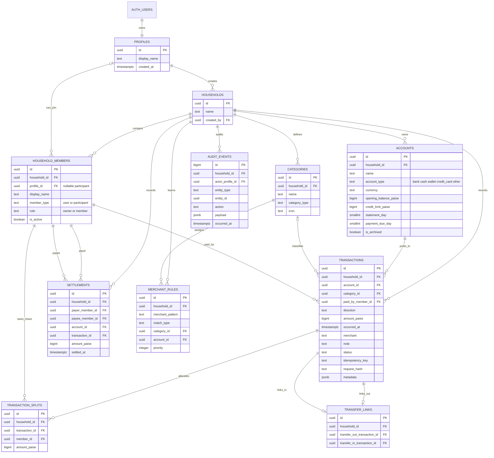

# Database structure

Artha uses PostgreSQL on Supabase in production. The local FastAPI demo uses a
smaller SQLite projection of the same ledger concepts. Every monetary value is
stored as an integer number of paise; floating-point money is never persisted.

## How a shared expense is stored

For an expense of Rs 1,200 paid from a bank account and shared by three family
members, Artha writes one `transactions` row and up to three
`transaction_splits` rows. The split rows must add up exactly to the transaction
amount. A database function performs the transaction, splits, and audit event in
one atomic operation and uses an idempotency key so retries cannot duplicate the
expense.

## Balance rules

- Bank, cash, and wallet opening balances are positive assets.
- Credit-card outstanding debt is a negative opening balance.
- Transfers are two linked transaction rows, never income or spending.
- Settlements reduce member balances without becoming an expense.
- Posted transactions are voided instead of being destructively deleted.

## Auto-tagging data

`merchant_rules` is the household's learned tagging layer. A corrected merchant
can be mapped to a category and optional account. These deterministic rules run
before the LLM. When no rule matches, the assistant may suggest one of the
existing category IDs with a confidence score; it cannot invent or write a
category silently.

## Security boundary

Supabase Auth owns login identities. Row Level Security limits every query to a
household the signed-in profile belongs to. Composite foreign keys prevent a row
from referring to an account, category, member, or transaction in another
household. The LLM receives compact read-only summaries from approved server
tools; it never receives database credentials and never executes SQL.
